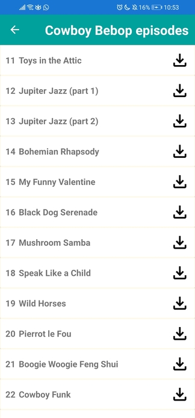

# AniAPI Episodes Integration

Project based on practical assignment #5 for the class "Desarrollo de Aplicaciones Móviles" from INTEC. The purpose of this project is to integrate an API and consume an endpoint.

## Search episodes Page

Base search page | Search page with network error
:---------------:|:-------------------------:
 | 

## Episodes list page

